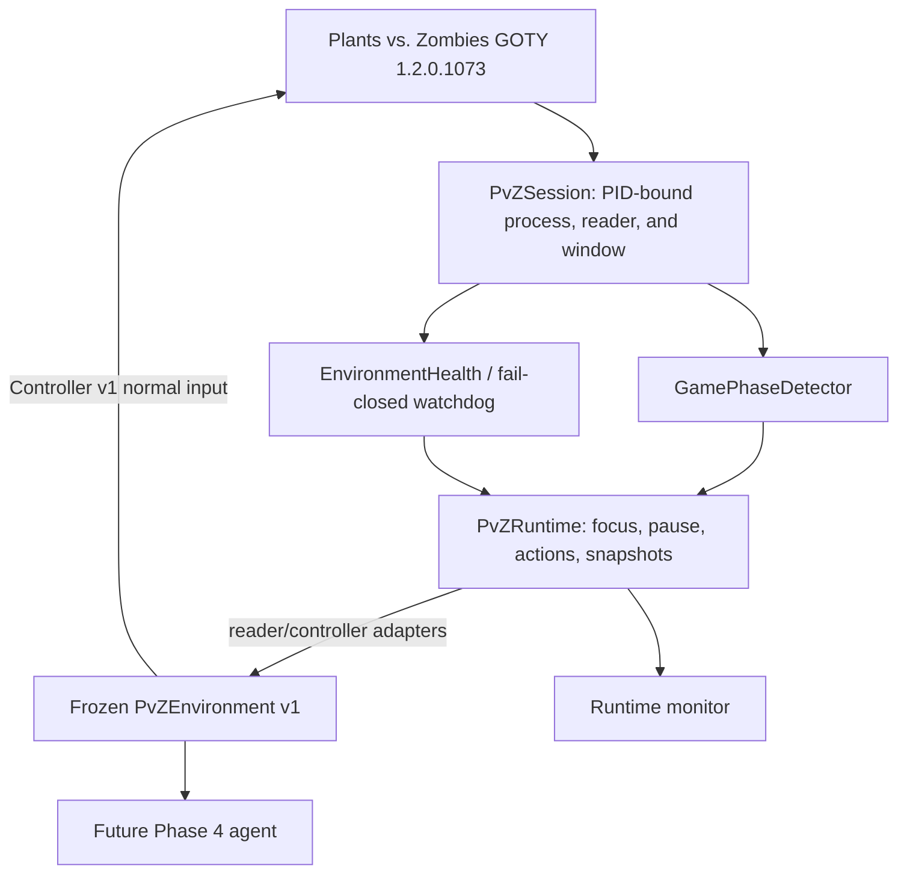

# PvZ AI Harness

A reverse-engineering and reinforcement-learning project built around the original Windows release of **Plants vs. Zombies: Game of the Year Edition**.

> **Current milestone: Phase 3.5 complete — the Phase 1–3.5 PvZ AI Harness is frozen at v0.1.0. Phase 4 deep-reinforcement-learning work is next.**

> **Development status:** v0.1.0 remains the frozen public release. Phase 4
> lifecycle support is implemented on a feature branch and awaits live
> validation before a v0.2.0 release.

## Quick start

```powershell
git clone --recurse-submodules https://github.com/b3d012/PvZ-DeepLearning.git
cd PvZ-DeepLearning
python -m pip install -e .
pvz-runtime-test --pretty
```

`pvz-runtime-test` is read-only: it prints a runtime-health snapshot and never
sends desktop input. See the [integration guide](docs/HARNESS.md),
[examples](examples), [changelog](CHANGELOG.md), and
[third-party notices](THIRD_PARTY_NOTICES.md).

## Architecture



`PvZEnvironment` orchestrates the reader, encoded observation, Action v1 mask,
Controller v1 semantic action, configured advancement interval, and subsequent
read/reconciliation; it does not add direct game input or memory writes.

The long-term goal is to train an AI agent to play the real game strategically rather than using a clone or custom simulator. Reading internal state provides exact HP, cooldown, wave, type, status and coordinate information so the learning problem can focus on strategy. Observation is read-only; normal agent actions are performed through ordinary Windows mouse input.

## Supported build

- **Plants vs. Zombies GOTY 1.2.0.1073**
- Windows 10/11
- version-specific layouts centralized in `pvz_reader/versions.py`

**The game is not included in this repository.** Supply your own legally obtained compatible installation.

## Project phases

| Phase | Status | Deliverable |
| --- | --- | --- |
| Phase 1 | ✅ Complete | External memory reader and frozen `GameState v1` |
| Placement layer | ✅ Complete | Special placement rules and invalid-action masks |
| Phase 2 | ✅ Complete | Controller v1: pickup, plant, shovel, safe Windows input |
| Phase 3 | ✅ Complete | Environment v1 frozen after offline and end-to-end live validation |
| Phase 3.5 | ✅ Complete / frozen | PID-bound runtime, watchdog, focus, pause/resume, diagnostics, monitor |
| Phase 4 | Next | Deep-RL baselines and training |
| Phase 5 | Planned | Evaluation, ablations, strategy analysis and demos |

## Phase 1 — Game-state reader

`pvz_reader/` reconstructs structured state from the live GOTY process, including sun/clock/scene, plants, zombies, seed cooldown/readiness, waves, mowers, pickups, projectiles and grid items. Reverse engineering combined reference-source inspection, small memory-inspection utilities, address watches and repeated live validation. Offsets from other builds were treated as hypotheses and verified against the target executable.

## Placement legality

`pvz_reader/placement.py` converts raw state into deterministic placement decisions and reason codes. It covers ordinary grass placement plus Lily Pads, Flower Pots, water plants, Grave Buster, Pumpkin, Coffee Bean, blockers/craters and upgrade plants such as Gatling Pea, Twin Sunflower, Gloom-shroom, Cattail, Winter Melon, Gold Magnet, Spikerock and Cob Cannon.

This layer will directly power invalid-action masking in Phase 3.

## Phase 2 — Controller v1

`pvz_controller/` translates semantic actions into normal mouse input. Controller v1 supports collecting an observed pickup, planting a seed-bank slot on a board tile and shoveling a tile, with precondition checks and post-observation helpers.

PvZ renders to an 800×600 logical client. Coordinates are defined in that logical space and scaled to the current Windows client rectangle. The Windows backend verifies the target process/window, rejects minimized or unusable clients, checks coordinate bounds, focuses the game and sends ordinary left-click input.

## Phase 3.1 — Observation encoder

`pvz_env/observation.py` converts frozen `GameState v1` data into a deterministic fixed-size NumPy `float32` vector for future learning code. The v1 schema encodes normalized global/wave state including Adventure level, a six-by-nine spatial plant map, ten seed-bank slots, five closest-to-house zombie slots per lane plus bounded live/overflow counts, and mower state per lane. Pickups and projectiles remain deferred. Grid items also remain deferred, although graves, craters, and ladders are strategically relevant candidates for a later observation revision; placement legality continues to use raw `GameState.grid_items`.

`GameState v1` does not authoritatively identify temporarily inactive rows in early Adventure levels. Scene only identifies five- versus six-row terrain, so Phase 3.2 action masking must explicitly solve inactive-row masking rather than infer it from an empty row.

## Phase 3.2 — Semantic action space

`pvz_env.actions` defines Action v1: a fixed 541-index space containing `WAIT` at index 0 followed by `PLANT(seed_slot, row, col)` in seed-slot, row, then column order. Its NumPy boolean mask delegates plant legality to `pvz_reader.placement.can_plant`; absent or unavailable seeds, invalid terrain, blockers, and prerequisite failures are masked without changing the action-space size. The caller supplies an explicit six-boolean `active_rows` episode configuration when a level has inactive lawn rows. Shovel and pickup actions are deferred; pickup handling is deferred from the environment bridge as well.

## Phase 3.3 — Environment step bridge

`pvz_env.environment.PvZEnvironment` provides typed `observe()` and `step(action_index)` operations over injected reader, Controller v1, sleeper, and clock seams. Every legal `WAIT` or `PLANT` advances exactly once for the configured interval, reads a new `GameState`, re-encodes Observation v1, rebuilds the Action v1 mask with the environment-owned active-row configuration, and returns typed reconciliation metadata plus a Reward v1 outcome. An issued PLANT missing from that first post-step read may use bounded read-only polling to verify its postcondition; WAIT does not poll. Reset automation and pickup management remain deferred.

## Phase 3.4–3.5 — Transition logging and reward outcomes

`pvz_env.logging` records each environment step as a versioned `TransitionRecord`: raw before/after game state, encoded observations, action masks, semantic action, Controller result, reconciliation, timing, and Reward v1 outcome. Schema v2 persists reward, component breakdown, terminal/truncation flags and reason, and reward schema/spec identity.

Reward v1 assigns `+1.0` for a detected win and `-1.0` for a detected loss. A newly spawned wave adds only `+0.01`; rejected actions and technical failures have small diagnostic penalties. WAIT and successful planting receive no activity reward. Because `GameState v1` has no validated win/loss signal, an injected terminal detector is required for natural outcomes and the default detector never guesses. Step horizons and repeated unavailable state are truncations, not losses.

## Phase 3.6 — Episode lifecycle

`PvZEnvironment` starts `UNINITIALIZED`. The caller manually prepares a running level, then calls `reset(EpisodeConfig(...))`; reset validates an available, unpaused state and returns the initial raw state, encoded observation, and action mask in `ResetResult`. The immutable episode configuration owns identity, active rows, timing/truncation limits, bounded plant-reconciliation settings, Reward v1 configuration, optional terminal detector, and optional caller-provided metadata. A legal action advances once for `step_interval_seconds`; only an issued PLANT whose first post-step read is still missing may perform bounded, read-only postcondition polling (default 0.75 s at 0.05 s intervals). That verification window is not an additional strategic step and never issues another click. A step is permitted only while `ACTIVE`; terminal/truncated outcomes block further gameplay until another explicit reset. Reset never navigates menus, chooses levels, dismisses dialogs, or creates a transition record.

## Phase 3.7 — Baselines and evaluation

`pvz_env.baselines` provides a reproducibly seeded random valid-action policy, a deliberately small scripted economy/threat policy, typed action-decision reasons, and `run_episode`/`summarize_episodes` helpers. Both use Environment v1 reset, Action v1 masks, `step()`, Reward v1, and episode outcomes. The scripted baseline has transparent access to the structured snapshot for its simple rules; it remains an engineering comparison baseline, not a learned-policy input design.

## Environment v1

`environment_contract()` exposes frozen checkpoint/evaluation metadata: Observation schema v1 and shape `(5534,)`, Action schema v1 and 541 actions, Environment schema v1, Reward schema v1, and transition schema v2. The public Environment v1 contract covers `EpisodeConfig`, `reset()`, lifecycle states, `step()` reconciliation, Reward v1 outcomes, JSONL transitions, and baseline evaluation.

The explicit live validation runner is dry-run by default:

```powershell
python tools/live_run_environment.py --active-rows 2,3,4 --policy heuristic --max-steps 5
```

It never infers active rows. For a known full board, provide `--all-rows`. Real Windows mouse input requires `--execute` and remains bounded by `--max-steps`:

```powershell
python tools/live_run_environment.py --all-rows --execute --policy heuristic --max-steps 10 --log-path trajectories/environment-v1.jsonl
```

Prepare an unpaused level manually; the runner does not navigate menus or dialogs. Environment v1 has been validated end-to-end against the real PvZ client with both heuristic and seeded random-valid-action baselines. The runs validated legal action selection, WAIT and PLANT reconciliation, transition logging, Reward v1 wave-progress shaping, and max-step truncation. Natural win/loss remains unavailable without a validated injected terminal detector, so the default live run ends at its configured max-step truncation. See [Phase 3 validation](docs/PHASE_3_VALIDATION.md) for recorded results.

## Runtime infrastructure

`pvz_runtime.PvZSession` automatically discovers a supported process, attaches
the reader by PID, binds Controller window lookup to that same PID, detects
stale attachments, and reconnects once per explicit health/read request after
a game restart. `PvZRuntime` adds conservative phase detection, structured
`EnvironmentHealth`, MANUAL/AUTO focus policy, idempotent verified pause/resume,
a single gated semantic-action path, observer-only mode, and compact JSON
diagnostic snapshots.

The runtime is a backward-compatible layer beneath the frozen
`pvz_env.PvZEnvironment`; it does not replace or version-bump Environment v1.
Phase 4 can construct Environment v1 with runtime adapters:

```python
from pvz_env import EpisodeConfig, PvZEnvironment
from pvz_runtime import FocusMode, PvZRuntime, RuntimeConfig

runtime = PvZRuntime(config=RuntimeConfig(focus_mode=FocusMode.MANUAL))
runtime.attach()
environment = PvZEnvironment(runtime.reader_adapter(), runtime.controller_adapter())
environment.reset(EpisodeConfig("level", active_rows=(True, True, True, True, True, False)))
```

Expected GOTY layout version is reported as `1.2.0.1073`, but exact binary
fingerprinting is not available and the runtime does not claim otherwise.
Because GameState v1 lacks authoritative application-screen and natural
win/loss fields, a missing Board is conservatively `MENU_OR_TRANSITION`, while
terminal phases require a separately validated injected provider.

## Phase 4 lifecycle candidate

The unreleased training-support branch adds `GameOutcome` and raw
`OutcomeEvidence`, `ResetResult` verification, `ManagedPickupCollector`, and
`TrainingEpisodeSupport`. Outcome evidence is separate from GameState v1.
Pickup clicks and strategic actions share `PvZRuntime.run_serialized()` and
the existing Controller v1 path. Reset success requires a distinct Board,
matching Adventure level, expected seeds when supplied, a near-initial clock,
an unpaused observable state, and no stale entities when configured.

The default restart driver deliberately refuses requests. A target-specific
automatic restart mechanism has not been live validated, so unattended
multi-episode training is not yet supported by a release. See
`docs/LIVE_RUNTIME_VALIDATION.md` for the operator protocol.

Launch the dependency-free Tk monitor:

```powershell
python tools/live_monitor_environment.py
```

Run the runtime live checklist in read-only mode first:

```powershell
python tools/live_test_runtime.py --snapshot snapshots/runtime.json
```

Focus and pause/resume input require explicit `--exercise-focus` and
`--exercise-escape` / `--exercise-pause` flags plus interactive confirmation. See
[Runtime architecture](docs/RUNTIME.md) and
[runtime live validation](docs/LIVE_RUNTIME_VALIDATION.md).

The read-only runtime path has been validated against a running client,
including automatic PID discovery, PID-matched window binding, coherent Board
observation, PAUSED classification, and the `can_observe`/`can_act` safety
distinction. Restart recovery, focus-policy input, pause/resume input, and
monitor controls were subsequently completed in final operator verification.

Initial monitor validation exposed dropped commands during refresh and gaps in
real Windows focus/key delivery that mocks alone could not prove. The corrected
FIFO scheduler, visible operation results, verified focus sequence, and
scan-code Escape path then passed final operator-verified live validation on
4 September 2026: AUTO focus, Pause/Resume, idempotence, MANUAL fail-closed
safety, and restart/reattach all succeeded. See
[runtime live validation](docs/LIVE_RUNTIME_VALIDATION.md).

## Repository layout

```text
pvz_reader/        GameState reader, version table, legality rules, diagnostics
pvz_controller/    Semantic Controller v1 and Windows input backend
pvz_env/           Observation, action, step, reward/outcome, logging, lifecycle, baselines, and frozen contract metadata
pvz_runtime/       Session ownership, phase/health, focus/pause gating, diagnostics, and monitor
tools/             Offline tests, live validation and inspection utilities
docs/              Technical development report
references/         pvztoolkit research-reference submodule
```

## Technical report

**[Technical Development Report (LaTeX)](docs/technical-development-report.tex)** documents the Phase 1–3.5 architecture, research methodology, validation, frozen contracts, and Phase 4 transition.

## Setup

Requirements: Windows 10/11, Conda/Miniconda, Git, and a compatible legally obtained PvZ GOTY 1.2.0.1073 installation.

```powershell
git clone --recurse-submodules https://github.com/b3d012/PvZ-DeepLearning.git
cd PvZ-DeepLearning
conda env create -f environment.yml
conda activate pvz-dl
```

If cloned without submodules:

```powershell
git submodule update --init --recursive
```

The environment remains intentionally lean: `pymem`, `psutil`, and `numpy`; the monitor uses Python's standard `tkinter`. RL/deep-learning packages are deferred to Phase 4.

## Validation

The offline suite does not require PvZ to be running and does not intentionally click the desktop:

```powershell
python -m unittest discover -s tools -p "test_*.py" -v
python -m compileall -q pvz_reader pvz_controller pvz_env pvz_runtime tools
```

It also runs automatically on Windows in GitHub Actions.

Files beginning with `tools/live_test_` intentionally interact with a running game and are excluded from CI.

## Safety and repository scope

- game observation is read-only;
- Controller v1 uses ordinary Windows mouse input;
- runtime input is gated by process, PID-bound window, fresh Board state, phase, pause, and verified focus;
- live tools are separated from offline tests;
- proprietary game files, caches, research dumps, model checkpoints and datasets are ignored;
- this repository does not distribute Plants vs. Zombies executables or assets.

## Next — Phase 4

Phase 3.5 is complete and the Environment v1/runtime harness is frozen. Phase
4 will add deep-RL training above the Phase 1--3.5 contracts:

1. deep-RL baseline design and implementation;
2. checkpoint/run metadata using the Environment v1 contract helper;
3. evaluation against the frozen random and scripted baselines.

The first deep-RL baseline remains out of scope for v0.1.0. Training
hyperparameters, checkpoints, and experiment configurations must live above
the frozen reader/controller/environment/runtime boundary.

## License

This project is licensed under [GPL-3.0-only](LICENSE). See
[THIRD_PARTY_NOTICES.md](THIRD_PARTY_NOTICES.md) for the `pvztoolkit` research
submodule, dependency notices, and provenance scope.

## References

The repository includes [`lmintlcx/pvztoolkit`](https://github.com/lmintlcx/pvztoolkit) as a Git submodule for reverse-engineering reference. It is not the runtime game engine.

Plants vs. Zombies is the property of its respective rights holders. This is an independent educational/research project and is not affiliated with or endorsed by PopCap or EA.
